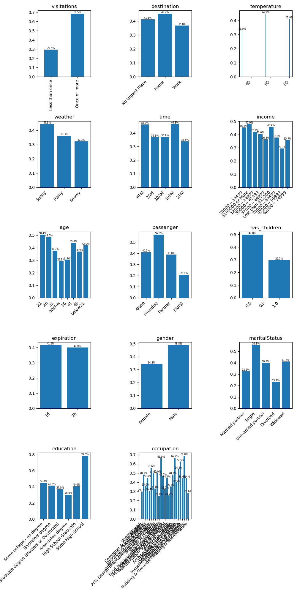

# Investigating Bar Coupons

`Bar` coupons are readily accepted by those who regularly frequent a bar; rates are especially high for high school dropouts.
The expiration doesn't seem to influence acceptance, possibly implying that acceptance is not an impulse decision.

The context seems to have a light influence on acceptance. Here, Bar coupons are slightly more accepted during nice warm weather.

## Observations

* Drivers that have visit a bar more than once a month are more likely to accept the coupon.
* Drivers are slightly less likely to accept a coupon if they are driving to work.
* Bar coupons are more likely to be accepted when the weather is sunny and warm.
* Bar coupons are more likely to be accepted in the evening.
* People with children are not as likely to accept Bar coupons.
* High school dropouts are much more likely to accept a Bar coupon.
* Single men are more likely to accept Bar coupons.

