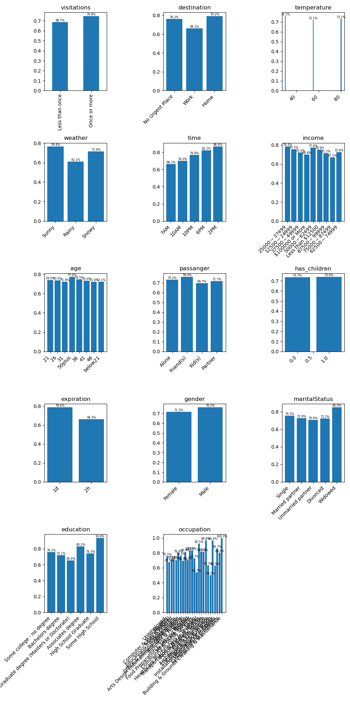

# Investigating Carry Out & Take Away Coupons

The coupon seems to be popular accepted regardless of the criteria, though there are slight influences.

Drivers who frequently get takeout and are not on their way to work are slightly more inclined to accept,
especially in the afternoon and evenings.  This suggests that the coupon is accepted when people are
considering what their next meal will be after work; possibly an impulse decision.

## Observations

* Drivers that have had takeout more than once a month are slightly more likely to accept the coupon.
* Drivers are slightly less likely to accept a coupon if they are driving to work.
* Takeout coupons are more likely to be accepted when the weather is sunny and warm.
* Takeout coupons are more likely to be accepted in the afternoon and evening.
* Widowed drivers are slightly more likely to accept a Takeout coupon.

