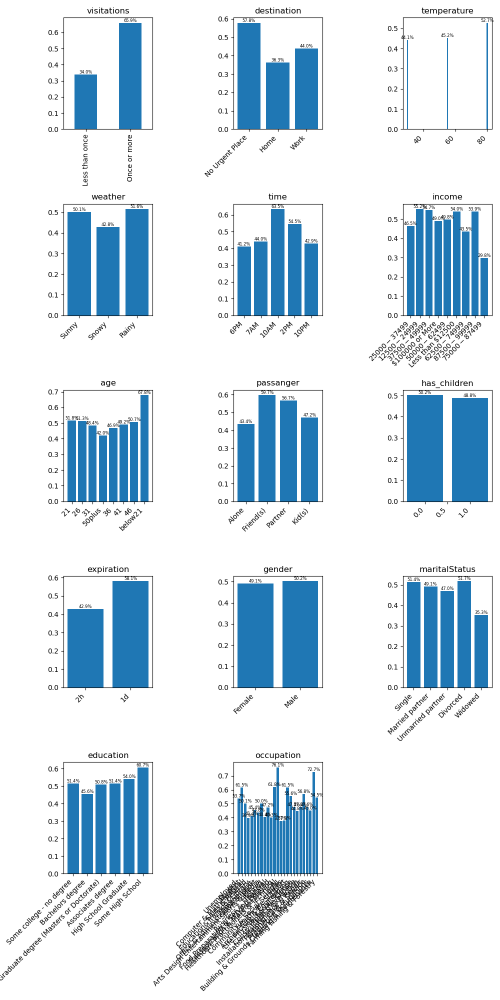

# Investigating Coffee Coupons

`Coffee` coupons are accepted by young, under 21, drivers who frequently go to coffee shops 
and are going to no place in particular in the mid-morning/early afternoon.

## Observations

* Frequent visitors a coffee house, a driver
 or more times per month, are very likely to accept a coupon
* If a driver doesn't urgently need to be anywhere specific at the time a driver
 will more likely accept a coupon
* If a driver is under 21 is more likely to accept than other age groups
* Temperature and weather do not seem to affect acceptance
* Oddly, the $75k-87k income group are significantly less likely to accept

