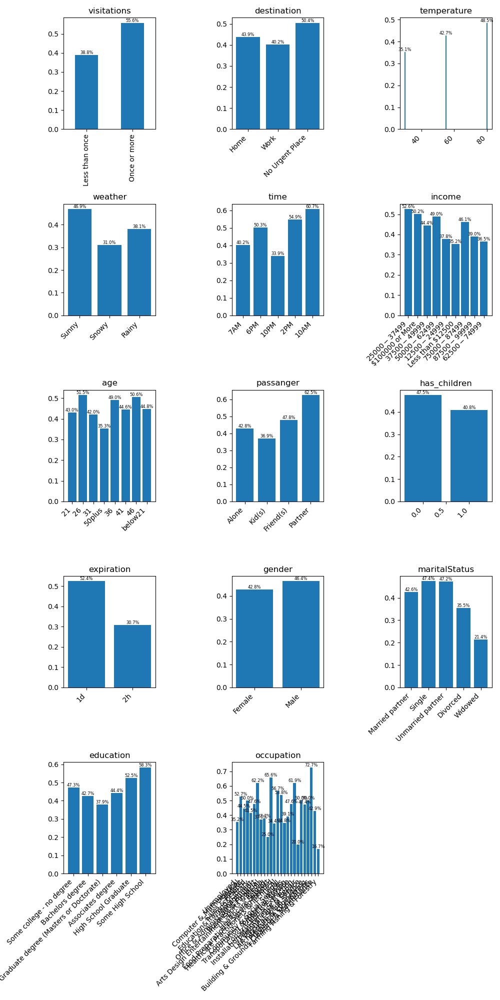

# Investigating Expensive Restaurant Coupons

`Restaurant(20-50)` coupons are more readily accepted by drivers who frequent expensive restaurants.
Coupons that are expire after a day are dramatically more accepted over ones that expire in several hours.
It is thought that this implies that the use of such a coupon requires planning when making such an expenditure.

Nice weather and temperature seems to influence the decision.

## Observations

* Frequent visitors an expensive restaurant, one or more times per month, are more likely to accept a coupon
* It doesn't significantly matter what one's destination is
* People with no children accept at a higher rate than ones that do.
* Divorcees and widowed drivers accept at a less rate than others.

