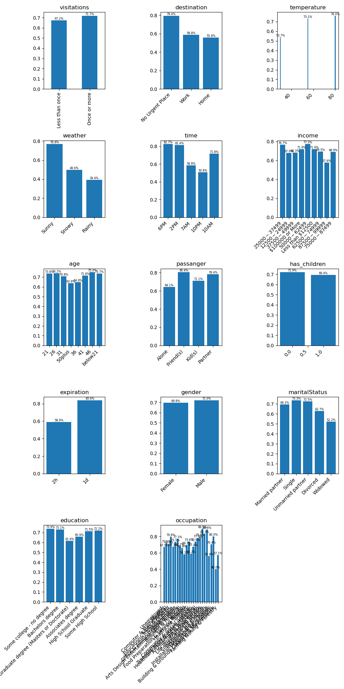

# Investigating Cheap Restaurant Coupons
`Restaurant(<20)` coupons seem to be accepted on warm sunny days when the driver
is not going anywhere in particular.  The acceptance during late afternoon and
early evening suggests that they may be thinking about what to do for dinner when
they received the coupon, though the one day expiry coupons are accepted more often
than the two hour ones.

## Observations

* The coupon seems to be accepted if there's good weather and one doesn't urgently need to be anywhere specific at the time.
* All other criteria do not seem to affect acceptance.

